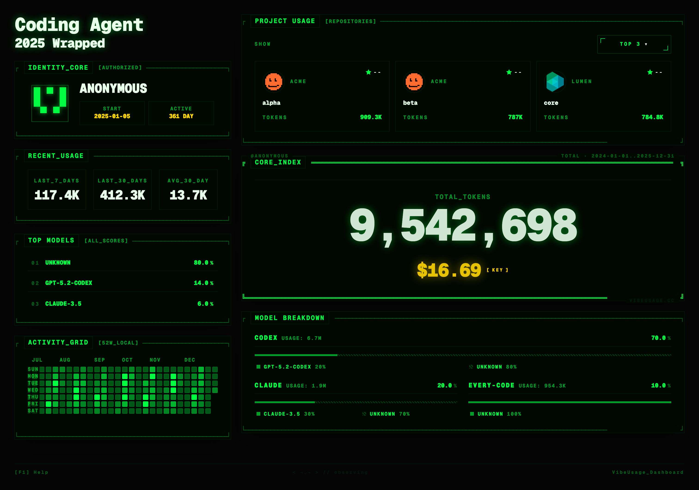
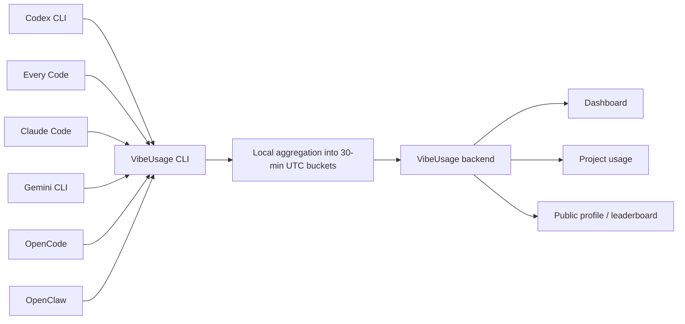
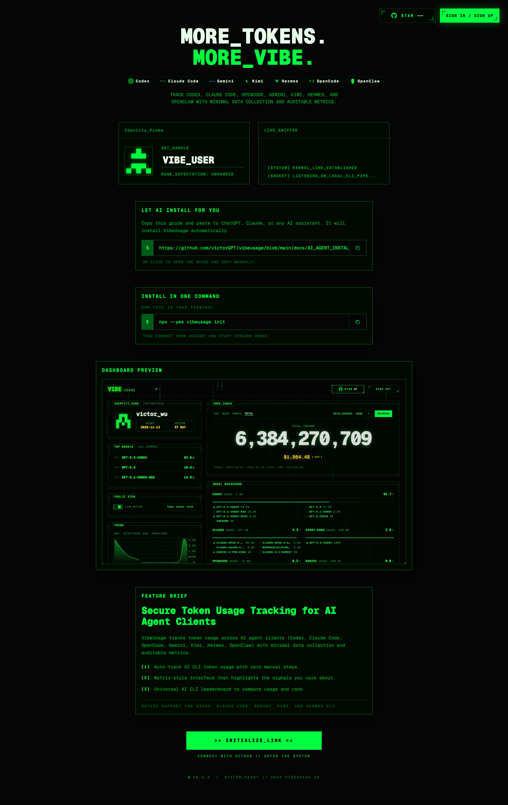

<div align="center">


# VibeUsage

**Track token usage across AI coding CLIs.**  
Local parsing, minimal data collection, and a shareable dashboard for Codex CLI, Claude Code, Gemini CLI, OpenCode, OpenClaw, and more.

[](https://www.npmjs.com/package/vibeusage)
[](LICENSE)
[](https://nodejs.org/)
[](https://www.vibeusage.cc)

**[Let your agent install VibeUsage](docs/AI_AGENT_INSTALL.md)** · [Open Dashboard](https://www.vibeusage.cc) · [Visit Website](https://www.vibeusage.cc)

Give the install guide to ChatGPT, Claude, Codex, or your preferred agent — it can set up VibeUsage for you.

<sub>Wherever you work, whichever agent you use, VibeUsage keeps your AI usage in one place.</sub>

<br/>

[Docs](docs/) · [Backend API](BACKEND_API.md) · [npm](https://www.npmjs.com/package/vibeusage) · [English](README.md) · [中文说明](README.zh-CN.md)

<br/>



</div>

---

VibeUsage is a **token usage tracker for AI agent CLIs**. It installs lightweight local hooks/plugins, reads usage from local logs or local databases, aggregates usage into time buckets on your machine, and syncs only the data needed to power a dashboard, cost breakdowns, project usage views, public profiles, and leaderboards.

It is currently **macOS-first**, with support focused on real developer workflows around **Codex CLI, Every Code, Claude Code, Gemini CLI, OpenCode, and OpenClaw**.

## Why VibeUsage

- **Agent-first onboarding** — hand the install guide to your AI agent, or run `npx --yes vibeusage init` yourself when you want manual setup.
- **Multi-client tracking** — unify usage across multiple AI coding CLIs in one timeline.
- **Privacy-first by design** — prompts, responses, code, and transcripts stay local.
- **Project-aware analytics** — view usage by public GitHub repository when repo identity can be resolved.
- **Useful dashboard, not just raw numbers** — see totals, model breakdowns, cost estimates, heatmaps, trends, and project usage.
- **Shareable presence** — optional public profile and leaderboard participation.
- **OpenClaw support with a sanitized path** — integrates through a local usage ledger instead of transcript parsing.

## Quickstart

### Requirements

- **Node.js 20.x**
- **macOS** is the primary supported environment today
- **`sqlite3` on PATH** for full OpenCode support

### Install and link your device

```bash
npx --yes vibeusage init
```

What happens next:

1. VibeUsage detects supported local AI CLIs.
2. It installs lightweight hooks/plugins where needed.
3. It opens browser auth by default, or accepts a dashboard-issued link code.
4. It performs an initial sync.

Then keep using your normal AI tools — sync runs automatically in the background.

> [!IMPORTANT]
> Since `vibeusage@0.3.0`, **`init` is the only command that mutates local integration config**. If you upgrade from an older install layout, re-run `npx vibeusage init`.

### Install with a dashboard link code

```bash
npx --yes vibeusage init --link-code <code>
```

This is useful when you want to copy an install command from the dashboard or let another AI assistant perform the install for you.

## Supported clients

| Tool | Detection | Sync trigger / install method | Primary local data source |
| --- | --- | --- | --- |
| **Codex CLI** | Auto-detected | `notify` hook | `~/.codex/sessions/**/rollout-*.jsonl` |
| **Every Code** | Auto-detected | `notify` hook | `~/.code/sessions/**/rollout-*.jsonl` |
| **Claude Code** | Auto-detected | `Stop` + `SessionEnd` hooks | local hook output |
| **Gemini CLI** | Auto-detected | `SessionEnd` hook | `~/.gemini/tmp/**/chats/session-*.json` |
| **OpenCode** | Auto-detected | plugin + local parsing | `~/.local/share/opencode/opencode.db` (legacy message files are fallback only) |
| **OpenClaw** | Auto-detected when installed | session plugin | local sanitized usage ledger |

### OpenClaw note

OpenClaw uses a dedicated privacy-preserving path:

**OpenClaw session plugin → local sanitized usage ledger → `vibeusage sync --from-openclaw`**

- no transcript parsing
- no prompt / response content upload
- requires an OpenClaw gateway restart after plugin linking

See [`docs/openclaw-integration.md`](docs/openclaw-integration.md) for the exact contract.

## What VibeUsage tracks

VibeUsage focuses on **usage accounting**, not content capture.

Tracked fields include:

- source / tool name
- model identity
- input tokens
- cached input tokens
- output tokens
- reasoning output tokens
- total tokens
- time bucket metadata
- project / public repo attribution when resolvable

## What VibeUsage does not upload

VibeUsage does **not** upload:

- prompts
- responses
- source code
- chat transcripts
- OpenClaw transcript content
- raw workspace contents
- secrets, tokens, or credentials

For OpenClaw specifically, the supported path is limited to sanitized local usage metadata plus token counts.

## How it works



At a high level:

1. `init` installs lightweight hooks/plugins for supported tools.
2. Your AI clients continue running normally.
3. VibeUsage reads local usage artifacts incrementally.
4. Usage is aggregated locally into **30-minute UTC buckets**.
5. Batched uploads power the dashboard and API.

## Dashboard features

VibeUsage ships with a hosted dashboard at [www.vibeusage.cc](https://www.vibeusage.cc).



### Included views

- **Usage summary** — total, input, output, cached, and reasoning token views
- **Model breakdown** — compare model families and individual models
- **Cost breakdown** — estimate usage cost from pricing data
- **Activity heatmap** — view active days and streak-like usage patterns
- **Trend views** — inspect usage over day / week / month / total windows
- **Project usage panel** — see which public GitHub repositories consumed the most tokens
- **Install panel** — generate install / link-code flows from the dashboard
- **Optional public view** — share a public page for your usage profile
- **Leaderboard** — participate in community rankings

## CLI commands

| Command | Purpose |
| --- | --- |
| `vibeusage init` | Install local integrations, link auth, and perform initial setup |
| `vibeusage sync` | Parse local usage and upload pending buckets |
| `vibeusage status` | Show current config, queue, upload, and integration status |
| `vibeusage diagnostics` | Emit machine-readable diagnostics JSON |
| `vibeusage doctor` | Run a health report and surface likely problems |
| `vibeusage uninstall` | Remove VibeUsage integration state |

### Command examples

```bash
# Install / repair local integration setup
npx --yes vibeusage init

# Preview setup changes without writing files
npx vibeusage init --dry-run

# Manual sync
npx vibeusage sync

# Drain the queue completely
npx vibeusage sync --drain

# Status overview
npx vibeusage status

# Full diagnostics JSON
npx vibeusage diagnostics --out diagnostics.json

# Health report
npx vibeusage doctor

# Remove integrations
npx vibeusage uninstall
```

Run `node bin/tracker.js --help` or `npx vibeusage --help` for the current CLI surface.

## Configuration

### Runtime settings

| Variable | Description | Default |
| --- | --- | --- |
| `VIBEUSAGE_INSFORGE_BASE_URL` | API base URL override | hosted default |
| `VIBEUSAGE_DASHBOARD_URL` | Dashboard URL override | `https://www.vibeusage.cc` |
| `VIBEUSAGE_DEVICE_TOKEN` | Preconfigured device token | unset |
| `VIBEUSAGE_HTTP_TIMEOUT_MS` | CLI HTTP timeout | `20000` |
| `VIBEUSAGE_DEBUG` | Debug output (`1` / `true`) | off |

### Local tool path overrides

| Variable | Description | Default |
| --- | --- | --- |
| `CODEX_HOME` | Codex CLI home override | `~/.codex` |
| `CODE_HOME` | Every Code home override | `~/.code` |
| `GEMINI_HOME` | Gemini CLI home override | `~/.gemini` |
| `OPENCODE_HOME` | OpenCode data directory override | `~/.local/share/opencode` |

## FAQ

### Does VibeUsage upload my code or conversations?

No. VibeUsage is designed around local parsing and minimal upload. It tracks token accounting and related metadata needed for usage reporting.

### Which command should I run after upgrading?

Run:

```bash
npx --yes vibeusage init
```

`init` is the only supported command that repairs or updates local integration config.

### My OpenCode totals look incomplete. What should I check?

Run:

```bash
npx vibeusage status
npx vibeusage doctor
```

If OpenCode support is incomplete, the most common issue is missing `sqlite3` on `PATH`, or a local SQLite query failure.

### My OpenClaw usage is not showing up. What should I check?

1. Run `npx vibeusage init`
2. Restart the OpenClaw gateway
3. Generate a real OpenClaw turn
4. Run `npx vibeusage sync --from-openclaw`
5. Inspect `npx vibeusage status` / `npx vibeusage doctor`

### Is this Linux / Windows ready?

Not fully yet. VibeUsage is currently **macOS-first**. Cross-platform support is still on the roadmap.

## For AI assistants

If you want ChatGPT, Claude, or another assistant to install VibeUsage for you, use the guide here:

- [`docs/AI_AGENT_INSTALL.md`](docs/AI_AGENT_INSTALL.md)

## Documentation

- [OpenClaw integration contract](docs/openclaw-integration.md)
- [Backend API](BACKEND_API.md)
- [Dashboard API notes](docs/dashboard/api.md)
- [Repository sitemap](docs/repo-sitemap.md)
- [AI agent install guide](docs/AI_AGENT_INSTALL.md)

## Development

```bash
git clone https://github.com/victorGPT/vibeusage.git
cd vibeusage
npm install
npm --prefix dashboard install
npm --prefix dashboard run dev
```

### Useful commands

```bash
# test suite
npm test

# full local CI gate
npm run ci:local

# build generated edge artifacts
npm run build:insforge

# verify generated edge artifacts are current
npm run build:insforge:check

# validate UI copy registry
npm run validate:copy

# validate UI hardcoded strings
npm run validate:ui-hardcode

# architecture guardrails
npm run validate:guardrails

# smoke checks
npm run smoke
```

## Contributing

Contributions are welcome.

Before opening a larger change:

- read [`AGENTS.md`](AGENTS.md)
- read [`docs/repo-sitemap.md`](docs/repo-sitemap.md)
- use the OpenSpec workflow for significant product or architecture changes
- keep user-facing copy in `dashboard/src/content/copy.csv`

## Roadmap

- broader Linux support
- Windows support
- richer project-level analytics
- better team / collaboration views
- more supported AI coding clients

## License

[MIT](LICENSE)

---

<div align="center">
  <b>More tokens. More vibe.</b><br/>
  <a href="https://www.vibeusage.cc">Website</a> ·
  <a href="https://github.com/victorGPT/vibeusage">GitHub</a> ·
  <a href="https://www.npmjs.com/package/vibeusage">npm</a>
</div>
