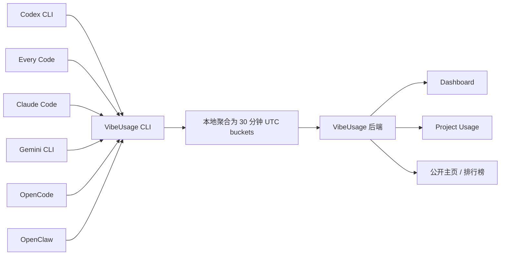

<div align="center">


# VibeUsage

**统一追踪 AI Coding CLI 的 Token 用量。**  
本地解析、最小化数据上传，并提供可分享的 Dashboard，支持 Codex CLI、Claude Code、Gemini CLI、OpenCode、OpenClaw 等工具。

[](https://www.npmjs.com/package/vibeusage)
[](LICENSE)
[](https://nodejs.org/)
[](https://www.vibeusage.cc)

**[让你的 Agent 安装 VibeUsage](docs/AI_AGENT_INSTALL.md)** · [打开 Dashboard](https://www.vibeusage.cc) · [访问官网](https://www.vibeusage.cc)

把安装指南直接交给 ChatGPT、Claude、Codex，或你常用的 Agent —— 它可以替你完成 VibeUsage 的安装与接入。

<sub>无论你在哪台设备上、用哪个 Agent 工作，VibeUsage 都能把所有 AI 用量汇总到一个地方。</sub>

<br/>

[文档](docs/) · [后端 API](BACKEND_API.md) · [npm](https://www.npmjs.com/package/vibeusage) · [English](README.md) · [中文说明](README.zh-CN.md)

<br/>


</div>

---

VibeUsage 是一个面向 **AI Agent / Coding CLI** 的 **Token 用量追踪器**。它会在本地安装轻量 hook / plugin，读取本地日志或本地数据库中的 usage 信息，在你的机器上聚合为时间桶，然后只同步 Dashboard、成本拆解、项目统计、公开主页和排行榜所需的最小数据。

当前它是 **macOS-first**，主要围绕真实开发者场景支持：**Codex CLI、Every Code、Claude Code、Gemini CLI、OpenCode、OpenClaw**。

## 为什么用 VibeUsage

- **Agent-first onboarding** —— 可以把安装指南直接交给 AI Agent，也可以在需要时自己运行 `npx --yes vibeusage init` 完成手动安装。
- **多客户端统一统计** —— 把多个 AI Coding CLI 的用量收敛到一条时间线里。
- **隐私优先** —— prompt、response、代码、transcript 默认不上传。
- **项目维度分析** —— 在可识别仓库身份时，支持按公开 GitHub 仓库查看 usage。
- **不只是原始数字** —— 提供总量、模型拆解、成本估算、热力图、趋势和项目使用情况。
- **可分享身份页** —— 支持可选公开主页与排行榜参与。
- **OpenClaw 专用安全路径** —— 通过本地 sanitized ledger 集成，而不是解析 transcript。

## 快速开始

### 环境要求

- **Node.js 20.x**
- 当前主要支持 **macOS**
- 为了获得完整 OpenCode 支持，系统需要有 **`sqlite3`**

### 安装并绑定设备

```bash
npx --yes vibeusage init
```

执行后会发生这些事：

1. VibeUsage 检测本地已安装的 AI CLI。
2. 自动为支持的工具安装轻量 hook / plugin。
3. 默认走浏览器认证，或者接受 Dashboard 下发的 link code。
4. 执行一次初始同步。

之后你只需要继续正常使用原本的 AI 工具，后台会自动同步。

> [!IMPORTANT]
> 从 `vibeusage@0.3.0` 开始，**只有 `init` 会修改本地集成配置**。如果你是从旧安装布局升级，请重新运行一次 `npx vibeusage init`。

### 用 Dashboard link code 安装

```bash
npx --yes vibeusage init --link-code <code>
```

适用于你想从 Dashboard 复制安装命令，或者想让另一个 AI 助手代为安装的时候。

## 支持的客户端

| 工具 | 检测方式 | 同步触发 / 安装方式 | 主要本地数据源 |
| --- | --- | --- | --- |
| **Codex CLI** | 自动检测 | `notify` hook | `~/.codex/sessions/**/rollout-*.jsonl` |
| **Every Code** | 自动检测 | `notify` hook | `~/.code/sessions/**/rollout-*.jsonl` |
| **Claude Code** | 自动检测 | `Stop` + `SessionEnd` hooks | 本地 hook 输出 |
| **Gemini CLI** | 自动检测 | `SessionEnd` hook | `~/.gemini/tmp/**/chats/session-*.json` |
| **OpenCode** | 自动检测 | plugin + 本地解析 | `~/.local/share/opencode/opencode.db`（旧 message 文件仅作 fallback） |
| **OpenClaw** | 安装后自动检测 | session plugin | 本地 sanitized usage ledger |

### OpenClaw 说明

OpenClaw 走的是专门的隐私保护路径：

**OpenClaw session plugin → 本地 sanitized usage ledger → `vibeusage sync --from-openclaw`**

- 不解析 transcript
- 不上传 prompt / response 内容
- link 完 plugin 后需要重启 OpenClaw gateway

详见 [`docs/openclaw-integration.md`](docs/openclaw-integration.md)。

## VibeUsage 会追踪什么

VibeUsage聚焦的是 **usage accounting**，不是内容采集。

会追踪的数据包括：

- source / 工具名
- model identity
- input tokens
- cached input tokens
- output tokens
- reasoning output tokens
- total tokens
- 时间桶元数据
- 在可识别时的 project / public repo 归属

## VibeUsage 不会上传什么

VibeUsage **不会上传**：

- prompt
- response
- 源代码
- 聊天 transcript
- OpenClaw transcript 内容
- 原始 workspace 内容
- secret、token、credential 等敏感信息

对于 OpenClaw，受支持路径只包含本地 sanitized usage metadata 与 token 计数。

## 工作原理



整体流程如下：

1. `init` 为支持的工具安装轻量 hook / plugin。
2. 你的 AI 客户端继续按原来的方式工作。
3. VibeUsage 增量读取本地 usage 工件。
4. 在本地聚合为 **30 分钟 UTC buckets**。
5. 批量上传，供 Dashboard 和 API 使用。

## Dashboard 功能

VibeUsage 提供托管 Dashboard： [www.vibeusage.cc](https://www.vibeusage.cc)


### 当前包含的视图

- **Usage summary** —— 总量、input、output、cached、reasoning tokens
- **Model breakdown** —— 查看模型家族与单模型占比
- **Cost breakdown** —— 基于价格数据估算成本
- **Activity heatmap** —— 查看活跃天数与使用节奏
- **Trend views** —— 支持 day / week / month / total 维度查看趋势
- **Project usage panel** —— 查看哪些公开 GitHub 仓库消耗了最多 token
- **Install panel** —— 可从 Dashboard 生成 install / link-code 流程
- **可选公开主页** —— 分享你的 usage profile
- **Leaderboard** —— 参与社区排行榜

## CLI 命令

| 命令 | 用途 |
| --- | --- |
| `vibeusage init` | 安装本地集成、完成认证绑定、执行初始设置 |
| `vibeusage sync` | 解析本地 usage 并上传待同步数据 |
| `vibeusage status` | 查看当前配置、队列、上传状态和集成状态 |
| `vibeusage diagnostics` | 输出机器可读的诊断 JSON |
| `vibeusage doctor` | 运行健康检查并给出问题提示 |
| `vibeusage uninstall` | 移除 VibeUsage 本地集成状态 |

### 命令示例

```bash
# 安装 / 修复本地集成
npx --yes vibeusage init

# 预览改动但不落盘
npx vibeusage init --dry-run

# 手动同步
npx vibeusage sync

# 一次性把队列尽量清空
npx vibeusage sync --drain

# 查看状态
npx vibeusage status

# 输出完整诊断 JSON
npx vibeusage diagnostics --out diagnostics.json

# 健康检查
npx vibeusage doctor

# 移除集成
npx vibeusage uninstall
```

可运行 `node bin/tracker.js --help` 或 `npx vibeusage --help` 查看当前 CLI 面。

## 配置

### 运行时配置

| 变量 | 说明 | 默认值 |
| --- | --- | --- |
| `VIBEUSAGE_INSFORGE_BASE_URL` | API base URL 覆盖 | hosted default |
| `VIBEUSAGE_DASHBOARD_URL` | Dashboard URL 覆盖 | `https://www.vibeusage.cc` |
| `VIBEUSAGE_DEVICE_TOKEN` | 预配置的 device token | unset |
| `VIBEUSAGE_HTTP_TIMEOUT_MS` | CLI HTTP 超时 | `20000` |
| `VIBEUSAGE_DEBUG` | Debug 输出（`1` / `true`） | off |

### 本地工具路径覆盖

| 变量 | 说明 | 默认值 |
| --- | --- | --- |
| `CODEX_HOME` | Codex CLI home 覆盖 | `~/.codex` |
| `CODE_HOME` | Every Code home 覆盖 | `~/.code` |
| `GEMINI_HOME` | Gemini CLI home 覆盖 | `~/.gemini` |
| `OPENCODE_HOME` | OpenCode 数据目录覆盖 | `~/.local/share/opencode` |

## FAQ

### VibeUsage 会上传我的代码或对话吗？

不会。VibeUsage 采用本地解析 + 最小上传原则，关注的是 usage accounting 及其相关元数据。

### 升级后我应该运行哪个命令？

运行：

```bash
npx --yes vibeusage init
```

`init` 是唯一会修复或更新本地集成配置的命令。

### 我的 OpenCode 总量看起来不完整，先检查什么？

运行：

```bash
npx vibeusage status
npx vibeusage doctor
```

最常见原因是系统里缺少 `sqlite3`，或者本地 SQLite 查询失败。

### 我的 OpenClaw usage 没显示，先检查什么？

1. 运行 `npx vibeusage init`
2. 重启 OpenClaw gateway
3. 先跑一个真实的 OpenClaw turn
4. 运行 `npx vibeusage sync --from-openclaw`
5. 用 `npx vibeusage status` / `npx vibeusage doctor` 检查状态

### 现在支持 Linux / Windows 吗？

还没有完全支持。当前阶段仍然是 **macOS-first**，跨平台支持仍在 roadmap 中。

## 给 AI 助手使用

如果你想让 ChatGPT、Claude 或其他 AI 助手帮你安装 VibeUsage，可以直接用这个指南：

- [`docs/AI_AGENT_INSTALL.md`](docs/AI_AGENT_INSTALL.md)

## 文档

- [OpenClaw 集成契约](docs/openclaw-integration.md)
- [后端 API](BACKEND_API.md)
- [Dashboard API 说明](docs/dashboard/api.md)
- [仓库导航图](docs/repo-sitemap.md)
- [AI Agent 安装指南](docs/AI_AGENT_INSTALL.md)

## 开发

```bash
git clone https://github.com/victorGPT/vibeusage.git
cd vibeusage
npm install
npm --prefix dashboard install
npm --prefix dashboard run dev
```

### 常用命令

```bash
# 测试
npm test

# 本地完整 CI 门禁
npm run ci:local

# 构建生成的 edge artifacts
npm run build:insforge

# 校验生成的 edge artifacts 是否最新
npm run build:insforge:check

# 校验 UI copy registry
npm run validate:copy

# 校验 UI 中硬编码字符串
npm run validate:ui-hardcode

# 架构 guardrails
npm run validate:guardrails

# smoke checks
npm run smoke
```

## 贡献

欢迎贡献。

如果是较大的改动，建议先：

- 阅读 [`AGENTS.md`](AGENTS.md)
- 阅读 [`docs/repo-sitemap.md`](docs/repo-sitemap.md)
- 对重要产品 / 架构变更走 OpenSpec 流程
- 所有用户可见文案统一维护在 `dashboard/src/content/copy.csv`

## Roadmap

- 更完整的 Linux 支持
- Windows 支持
- 更丰富的项目级分析
- 更好的团队 / 协作视图
- 更多 AI Coding Client 支持

## License

[MIT](LICENSE)

---

<div align="center">
  <b>More tokens. More vibe.</b><br/>
  <a href="https://www.vibeusage.cc">官网</a> ·
  <a href="https://github.com/victorGPT/vibeusage">GitHub</a> ·
  <a href="https://www.npmjs.com/package/vibeusage">npm</a>
</div>
